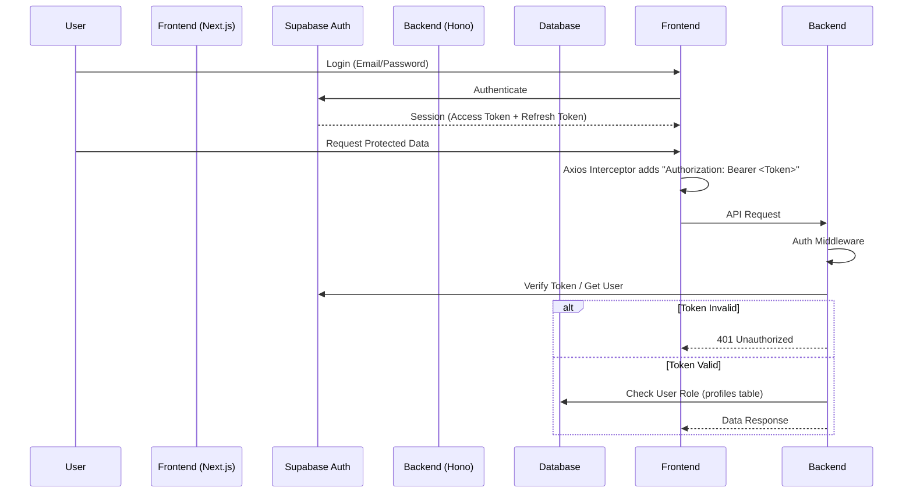

# Authentication Flow

This document details how Authentication and Authorization work across the PTK-Connext stack.

## Overview

We use **Supabase Auth** as the identity provider. The flow involves the Frontend (Next.js) obtaining a JWT and passing it to the Backend (Hono), which validates it and enforces permissions.



## 1. Frontend: Login & Session Management

The frontend uses `@supabase/ssr` to handle authentication.

- **Login**: Users log in using the login form. The `createClient` helper (`apps/frontend/src/lib/supabase/client.ts`) initializes the connection.
- **Session**: Supabase manages the session in cookies/local storage.

### Token Injection

All API requests to the backend are routed through a custom **Axios Instance** (`apps/frontend/src/lib/api/axios-instance.ts`).

```typescript
// Simplified logic
instance.interceptors.request.use(async (config) => {
    const supabase = createClient();
    const { data: { session } } = await supabase.auth.getSession();

    if (session?.access_token) {
        config.headers.Authorization = `Bearer ${session.access_token}`;
    }
    return config;
});
```

## 2. Backend: Token Verification

The backend protects endpoints using the `authMiddleware` (`apps/backend/src/middlewares/auth.ts`).

1.  **Extraction**: The middleware extracts the Bearer token from the `Authorization` header.
2.  **Validation**: It calls `supabase.auth.getUser(token)` to verify the signature and expiration.
3.  **Context**: If valid, the user object is attached to the Hono context (`c.set('user', user)`).

## 3. Authorization (RBAC)

Authentication says "who you are". Authorization says "what you can do".

- **Roles**: Defined in the `profiles` table (e.g., `student`, `teacher`, `admin`, `student_affairs`).
- **Checks**:
    - **Route Level**: Middleware can enforce roles (e.g., "Teachers Only").
    - **Data Level**: Endpoints like `/conduct/me` check the authenticated user's ID to ensure they only access their own data.

## 4. Special Case: Student Import

When importing students via `apps/backend/scripts/import-students.ts`, we programmatically create Supabase Auth users using the `SUPABASE_SERVICE_ROLE_KEY`.

- **Initial Password**: The student's Citizen ID is used as the initial password.
- **Email**: Formatted as `${studentId}@schoolptk.ac.th`.
